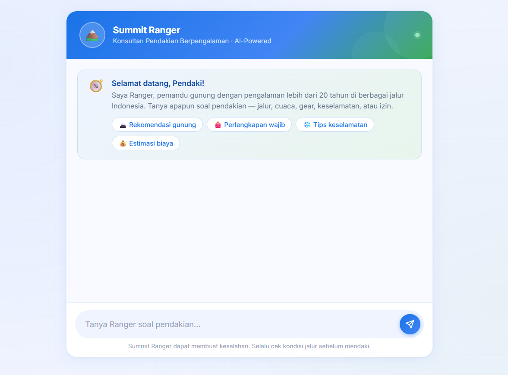
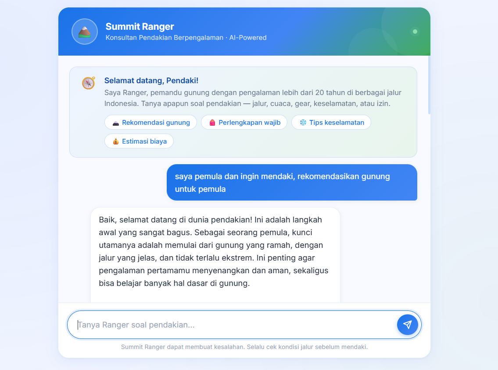

# Summit Ranger — Konsultan Pendakian Gunung AI

**Summit Ranger** adalah aplikasi asisten pendakian berbasis kecerdasan buatan (AI) yang dirancang untuk membantu para pendaki merencanakan petualangan mereka di gunung-gunung Indonesia secara aman dan terorganisir.

Proyek ini merupakan **Project Final** untuk program **Maju Bareng AI for Developers** yang diselenggarakan oleh **Hactiv8 Indonesia**.

---

## 📷 Tampilan Antarmuka (Screenshots)

Berikut adalah visualisasi antarmuka dari aplikasi Summit Ranger:

### 1. Tampilan Sebelum Chat (Welcome Screen)

Berikut adalah tampilan beranda awal sebelum pengguna mengirimkan pertanyaan. Terdapat rekomendasi tombol cepat (_Quick Prompts_) untuk mempermudah memulai percakapan.



### 2. Tampilan Balasan Chat (Gemini AI Response)

Berikut adalah contoh ketika Ranger (AI) merespons pertanyaan pengguna. Tampilan teks telah disesuaikan agar format Markdown (seperti teks tebal, cetak miring, header, dan daftar poin) dapat terender dengan rapi dan aman.



_(Catatan: Silakan letakkan gambar tangkapan layar Anda di dalam folder `public/images/` dengan nama file `sebelum-chat.png` dan `balasan-chat.png` agar muncul di atas)._

---

## 🌟 Fitur Utama

- **Rekomendasi Jalur & Gunung**: Rekomendasi lokasi pendakian yang disesuaikan dengan tingkat pengalaman pendaki.
- **Perencanaan Logistik & Perlengkapan**: Panduan barang bawaan wajib dan logistik perbekalan berdasarkan durasi mendaki.
- **Panduan Keselamatan**: Informasi penanganan darurat seperti hipotermia, penyakit ketinggian (_acute mountain sickness_), navigasi dasar, dan survival.
- **Responsif & Interaktif**: Desain antarmuka yang modern, dinamis dengan transisi halus, serta nyaman diakses dari perangkat mobile maupun desktop.
- **Markdown Rendering**: Balasan AI yang menggunakan format teks tebal (`**bold**`), miring (`*italic*`), bullet list, header, maupun inline code akan terformat otomatis menjadi elemen HTML yang bersih dan rapi.

---

## 🛠️ Teknologi yang Digunakan

- **Backend**: [Node.js](https://nodejs.org/) & [Express.js](https://expressjs.com/)
- **AI Engine**: Google Gemini API SDK (`@google/genai`) dengan model `gemini-2.5-flash`
- **Frontend**: Vanilla JavaScript, HTML5, & Custom CSS3 (Aesthetic UI)

---

## 🚀 Panduan Instalasi & Cara Menjalankan

Ikuti langkah-langkah di bawah ini untuk menjalankan proyek ini di komputer lokal Anda:

### 1. Unduh / Clone Repositori

```bash
git clone <url-repositori-anda>
cd gemini-chatbot-api
```

### 2. Instalasi Dependensi

Jalankan perintah berikut untuk mengunduh modul-modul Node.js yang diperlukan:

```bash
npm install
```

### 3. Konfigurasi Kunci API (API Key)

Buat berkas `.env` baru di direktori utama (root) proyek Anda dan tambahkan Gemini API Key Anda:

```env
GEMINI_API_KEY=isi_dengan_api_key_gemini_anda
```

### 4. Jalankan Aplikasi

Jalankan server Node.js:

```bash
node index.js
```

Setelah server aktif, buka peramban (browser) Anda dan akses alamat berikut:

```
http://localhost:3000
```
